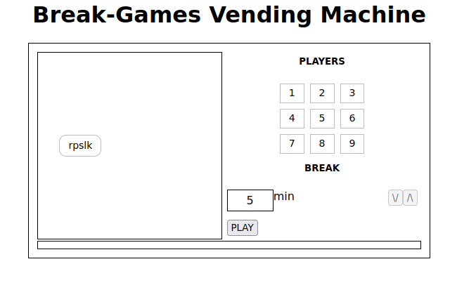
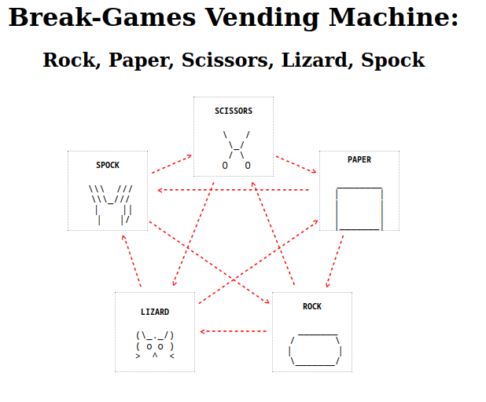

# Break-Games vending machine
Break-Games Vending Machine is a simple webapp developed with HTML/CSS and JS with Python Flask backend, the project is thought to have simple games as webapps which are deployed as containers and by user-request through the frontend of vending-machine. This is a learning project to practice Docker and Kubernetes technologies.

Repo can be found at [Break-Games Vending Machine](https://github.com/sparki-json/break-games-vm)

## TO-DOs
- [x] Creation of Dockerfile for initial frontend and backend
- [x] Create simple webapp game with Dockerfile separated for frontend and backend
- [ ] Deploy specific kubernetes pod on-demand
- [ ] CI/CD pipeline using Github actions
- [ ] Add multiplayer (to practice web online)
- [ ] Add more games (to make it funnier?)

## Screenshots
### vending machine


### current games
#### rock paper scissors lizard spock


## Issues fixed
### ParrotOS repository conflict
**ERROR** ParrotOS version 6.4 has codename `lory` which is not available with recommended Docker installation.

**FIX** Add repository codename `trixie` instead.

### Docker deamon and minikube deamon
**ERROR** When creating images they're stored in default Docker deamon and cannot be accessed from Kubernetes.

**FIX** Change default Docker deamon to minikube deamon with `eval $(minikube docker-env)`.

### Service type
**ERROR** Using `LoadBalancer` type for services is not supported by `minikube` cluster.

**FIX** Change to `NodePort` type.

### Minikube no external IP
**ERROR** Command `minikube service --all` returns:
```
❌  Exiting due to MK_UNIMPLEMENTED: minikube service is not currently implemented with the builtin network on QEMU
```

**FIX** minikube services are not available when using QEMU driver, delete existing minikube cluster with `minikube delete` and create a new one with `minikube start --driver=docker` which is the preferred driver.
